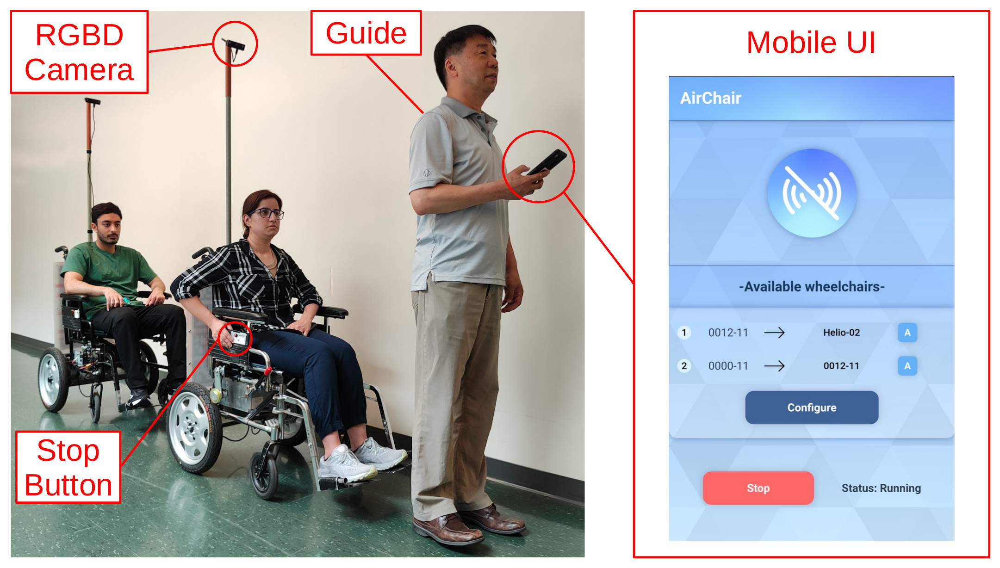

# AirChair

AirChair is a semi-autonomous human transportation system composed of multiple wheelchairs operating as a convoy. The first wheelchair follows an on-foot human guide, the second wheelchair follows the first, and so on. Each wheelchair independently tracks its target with the help of an RGBD camera, and performs motion planning to follow along while steering clear of obstacles. The guide manages the convoy through a mobile control interface, allowing them to intervene as needed to ensure passenger safety.

_The AirChair convoy system. The Guide leads the convoy, managing it through the UI running on the mobile control device. Each wheelchair is equipped with an onboard computer (not shown) connected to an RGBD camera for obstacle detection and leader tracking. Passengers can press the stop button to stop their own wheelchair, and by signal propagation through the control device, the entire convoy._

## Publications

* Perroni Filho, Helio, et al. "Robot Wheelchair Convoys for Assistive Human Transportation." _2024 IEEE International Conference on Smart Mobility (SM)._ IEEE, 2024. [^](https://ieeexplore.ieee.org/document/10733535)
* Poster presentation at the [CVR-CIAN Conference 2025](https://doi.org/10.25071/10315/42927). [^](https://raw.githubusercontent.com/ElderLab-York-University/airchair/master/posters/CVR-CIAN-2025.pdf)

## Demos

* [2024-03-15 - Lassonde School of Engineering](https://youtu.be/g33gvL-KgiM?si=2ahQljLNOiHgWY9Q)
