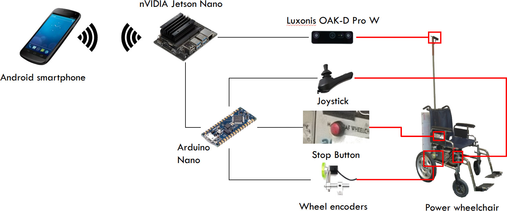

# AirChair

AirChair is a semi-autonomous human transportation system composed of multiple wheelchairs operating as a convoy. The first wheelchair follows an on-foot human guide, the second wheelchair follows the first, and so on. Each wheelchair independently tracks its target with the help of an RGBD camera, and performs motion planning to follow along while steering clear of obstacles. The guide manages the convoy through a mobile control interface, allowing them to intervene as needed to ensure passenger safety.

_The AirChair convoy system. The Guide leads the convoy, managing it through the UI running on the mobile control device. Each wheelchair is equipped with an onboard computer (not shown) connected to an RGBD camera for obstacle detection and leader tracking. Passengers can press the stop button to stop their own wheelchair, and by signal propagation through the control device, the entire convoy._

Two AirChair units have been built by retrofitting powered wheelchairs with sensors, computing and communication components. Each wheelchair is equipped with an RGBD camera placed at the top of a pole mounted on its back. The camera is connected to an onboard computer located under the seat. The computer is also connected to a microcontroller unit (MCU) that interfaces with the wheelchair's motor system and the stop button placed on one of the wheelchair's arms. A Bluetooth connection to an Android smartphone allows a guide to control the unit.

_The AirChair hardware architecture. A powered wheelchair is retrofitted with a Luxonis OAK-D Pro W RGBD camera, an nVIDIA Jetson Nano onboard computer, an Arduino Nano microcontroller, wheel encoders and a stop button. The microcontroller connects to the wheelchair’s joystick (tucked under the seat to prevent the passenger from interacting with it), the wheel encoders (which measure wheelchair speed) and the stop button, working as an interface between them and the onboard computer, which hosts the navigation software. An Android smartphone communicates with the onboard computer over a Bluetooth connection, providing a user interface to the guide._

Convoy Control is an Android app running on the mobile device and communicating with the wheelchairs over a Bluetooth connection. It exchanges commands and notifications with the guide through a UI component, which instructs the Command Host to set navigation targets (either a specified person or wheelchair) and the motion state (self-motion, coasting, braking) of selected wheelchairs. The Command Host also responds to alerts from wheelchairs by notifying the guide through the UI while also sending brake commands to the other wheelchair units in the convoy.

Wheelchair Control is mainly implemented as a collection of [ROS nodelets](https://wiki.ros.org/nodelet)​ all running on a single manager. Components run concurrently, exchanging messages via memory pointers, which is lightweight and prevents race conditions. Wheelchair Control is subdivided into Perception and Navigation components, the former responsible for obstacle detection and target tracking, the latter for motion planning and control. The Target Tracker can send the Command Host an alert in case it loses track of the current target. The same applies if the Motion Planner fails to find a path around obstacles, or the Motion Controller receives a braking command from the wheelchair's stop button.

_The AirChair software stack. Rectangles indicate software processes, and ellipses, communication channels. The Convoy Control module runs in the Android smartphone, and Wheelchair Control, in the AirChair onboard computer._

The two-wheelchair AirChair convoy has been the subject of experiments in a number of different locations, mostly across the York University campus — but also on two occasions at the Pearson International Airport.

_AirChair experiments were conducted at various locations around the York University campus (a-b), as well as the Pearson International Airport (c)._

## Publications

* Perroni Filho, Helio, et al. "Robot Wheelchair Convoys for Assistive Human Transportation." _2024 IEEE International Conference on Smart Mobility (SM)._ IEEE, 2024. [^](https://ieeexplore.ieee.org/document/10733535)
* Poster presentation at the [CVR-CIAN Conference 2025](https://doi.org/10.25071/10315/42927). [^](https://raw.githubusercontent.com/ElderLab-York-University/airchair/master/posters/CVR-CIAN-2025.pdf)

## Demos

* [2024-03-15 - Lassonde School of Engineering](https://youtu.be/g33gvL-KgiM?si=2ahQljLNOiHgWY9Q)
